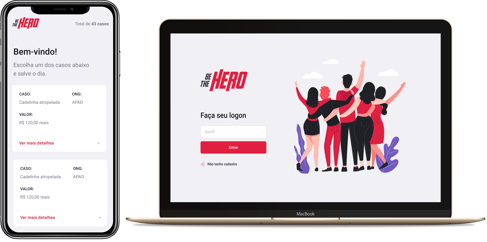

<p align="center">

<h1 align="center" >Semana Omnistack 11</h1>
<p align="center">Projeto <strong>Be The Hero</strong> desenvolvido durante a 11ª edição da Semana Omnistack da <a href="https://rocketseat.com.br">Rocketseat</a> 🚀👩🏽‍🚀</p>

## 💻 Tecnologias

- [Node.js](https://nodejs.org/en/)
- [React](https://reactjs.org)
- [React Native](https://facebook.github.io/react-native/)
- [Expo](https://expo.io/)
- [Jest](https://jestjs.io/
- [SQLite3](https://www.sqlite.org/index.html)
- [Celebrate](https://www.npmjs.com/package/celebrate)

## 🤔 Sobre este Projeto

O objetivo do projeto é permitir que você crie sua ONG e entre em contato com outras, fazendo doações e ajudando elas a resolverem os seus problemas, tornando-se assim o **herói** do caso daquela ONG.

## 🚀 Instalação

**Clone o Repositório**

```
git clone https://github.com/rodrigosuelli/semana-omnistack-11.git

cd semana-omnistack-11
```

**Instale as dependências com NPM ou Yarn**

```
npm install
//ou
yarn
```

## :memo: Licença
Este projeto está licenciado sob a licença [MIT](./LICENSE) &copy; [Rocketseat](https://rocketseat.com.br/).
